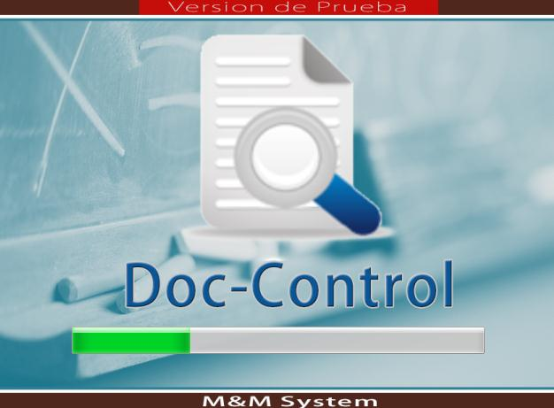
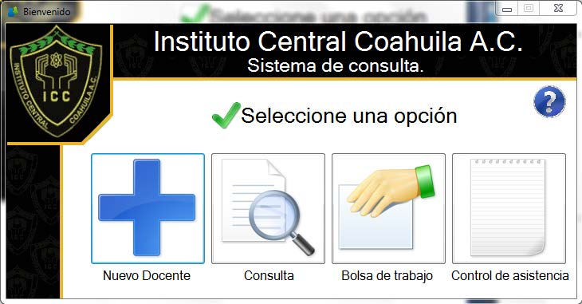
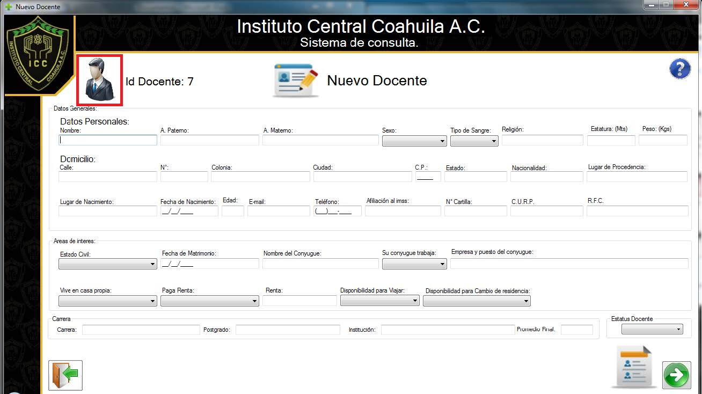

# 📦 TeacherHub (Internal Management System)

## 🧭 Overview
**TeacherHub** is a secure, Windows-based internal application developed during my university social service at ICC School. It manages teacher profiles, replacing manual, paper-based processes with a fully digital system.

TeacherHub centralizes teacher personal data, professional experience, and academic background for administrative staff, enhancing information retrieval, operational efficiency, and security.

### Loading page

### Home Page

### New Teacher

---

## 💡 Idea & Concept
- Replace paper-based teacher record-keeping with a centralized digital system.
- Reduce document loss, duplication, and inconsistencies.
- Ensure secure access to sensitive academic and personal information.

---

## ✨ Features & Functionality
- **Teacher Profile Management**:
  - Create, Read, Update, and Delete (CRUD) operations for teacher records.
  - General information (name, photo, address, SSN, contact).
  - Academic background (schools, degrees, languages, certifications).
  - Work experience (employment history, previous schools).
  - Family information (emergency contacts, relationships).
  - Interests, hobbies, personal details.

- **Authentication**:
  - Secure login with encrypted credentials.
  - User access control to sensitive data.

- **Future Module Planning**:
  - Talent search for future staffing.
  - Attendance tracking.

---

## ⚙️ Tech Stack
- **Frontend**: Windows Forms (C#)
- **Database**: SQL Server
- **IDE**: Visual Studio
- **Security**: Encrypted login & access control

---

## 🏗 Architecture & Design
- Three-layer architecture: Presentation, Business Logic, and Data Access layers.
- Entity Relationship (ER) modeling to structure teacher data relationships.
- Secure data storage with SQL Server, backup and maintenance plans.

---

## 🚀 Deployment & Hosting
- Installed and maintained locally at ICC School’s administrative offices.
- Designed for internal network access only.

---

## 🧑‍💻 My Role & Contributions
- Full-stack development of the entire platform.
- Database schema design and optimization.
- Frontend UI/UX customization for administrative ease-of-use.
- Secure login and authentication implementation.

---

## 🧗 Challenges & Learnings
- Transitioning users from manual paper workflows to digital interfaces.
- Learning enterprise-grade secure application development practices early.
- Real-world experience in multi-tiered Windows applications and database security.

---

## 📈 Future Enhancements
- Integrate web-based dashboard for remote access.
- Migrate attendance tracking and reporting online.
- Extend database to accommodate evolving staffing needs.

---

## 🤝 Project Type
University Social Service Project.

---

## 🪪 License
⚠️ Internal Use Only — Copyright reserved to ICC School.